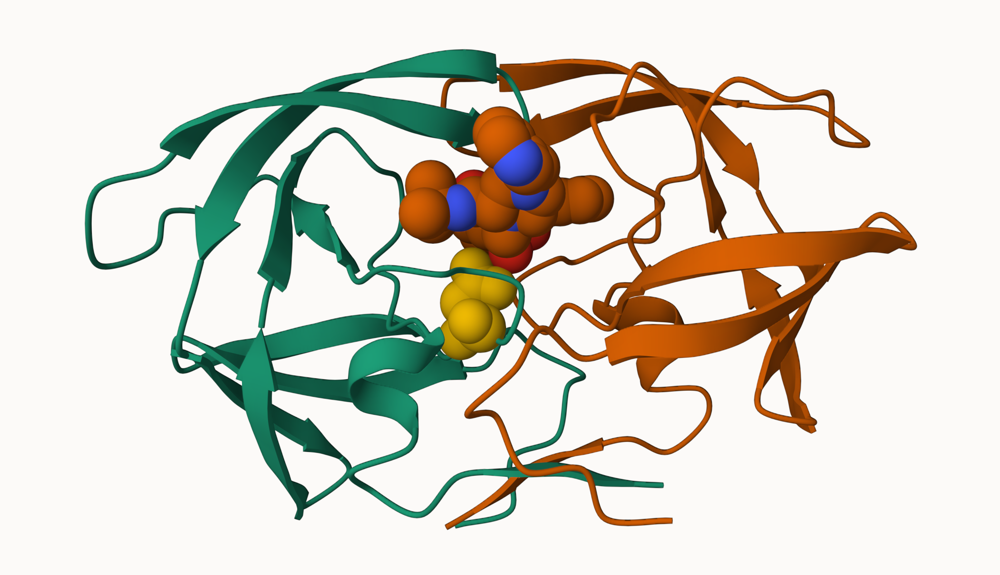

BIMM 143 Lab 09
================
Patric Young

# What is in the PDB anyways?

The main database of biomolecular structures is called the PDB and is
available at www.rcsb.org.

Lets begin by seeing what is in this database.

``` r
pdbstats <- read.csv("PDB.csv", row.names = 1)
head(pdbstats)
```

                              X.ray    EM    NMR Multiple.methods Neutron Other
    Protein (only)          152,809 9,421 12,117              191      72    32
    Protein/Oligosaccharide   9,008 1,654     32                7       1     0
    Protein/NA                8,061 2,944    281                6       0     0
    Nucleic acid (only)       2,602    77  1,433               12       2     1
    Other                       163     9     31                0       0     0
    Oligosaccharide (only)       11     0      6                1       0     4
                              Total
    Protein (only)          174,642
    Protein/Oligosaccharide  10,702
    Protein/NA               11,292
    Nucleic acid (only)       4,127
    Other                       203
    Oligosaccharide (only)       22

**Q1:** What percentage of structures in the PDB are solved by X-Ray and
Electron Microscopy.

X-ray: 85.9%

Electron Microscopy: 7.02%

92.92%

``` r
as.numeric("1000") + 1
```

    [1] 1001

``` r
as.numeric(pdbstats$X.ray)
```

    Warning: NAs introduced by coercion

    [1]  NA  NA  NA  NA 163  11

``` r
gsub(",", "", pdbstats$X.ray)
```

    [1] "152809" "9008"   "8061"   "2602"   "163"    "11"    

``` r
as.numeric (gsub(",", "", pdbstats$X.ray))
```

    [1] 152809   9008   8061   2602    163     11

``` r
n.xray <- sum( as.numeric(gsub(",", "", pdbstats$X.ray)))
n.em <- sum( as.numeric(gsub(",", "", pdbstats$EM)))
n.total <- sum( as.numeric(gsub(",", "", pdbstats$Total)))
```

``` r
p.xray <- (n.xray/n.total)*100
p.em <- (n.em/n.total)*100
```

``` r
round(p.xray,3)
```

    [1] 85.903

``` r
round(p.em,2)
```

    [1] 7.02

There are 1.72654^{5} protein structures and (85.9%) and 1.4105^{4}
(7.02%) Em structures in the current PDB database.

**Q2:** What proportion of structures in the PDB are protein?

``` r
as.numeric(gsub(",", "", pdbstats$Total))/ n.total *100
```

    [1] 86.89175473  5.32469600  5.61824587  2.05335642  0.10100105  0.01094593

86.89% of structures in the PDB are protein.

**Q3:** Type HIV in the PDB website search box on the home page and
determine how many HIV-1 protease structures are in the current PDB?

It is not straightforward to find all HIV-1 protease structures using
pain text searching on the database.

A wee pic of HIV-1 Protease from Molstar.



**Q4**: Water molecules normally have 3 atoms. Why do we see just one
atom per water molecule in this structure?

The resolution is at 2.00 Angstroms. In this resolution, only Oxygen
atoms are visible. The resolution would have to be under 1.00 Angstrom
in order to see the Hydrogen atoms.

## Working with structure data in R

we will use the `bio3d` package for this:

``` r
library(bio3d)
```

Read a PDB file from the online database

``` r
pdb <- read.pdb("1hsg")
```

      Note: Accessing on-line PDB file

``` r
pdb
```


     Call:  read.pdb(file = "1hsg")

       Total Models#: 1
         Total Atoms#: 1686,  XYZs#: 5058  Chains#: 2  (values: A B)

         Protein Atoms#: 1514  (residues/Calpha atoms#: 198)
         Nucleic acid Atoms#: 0  (residues/phosphate atoms#: 0)

         Non-protein/nucleic Atoms#: 172  (residues: 128)
         Non-protein/nucleic resid values: [ HOH (127), MK1 (1) ]

       Protein sequence:
          PQITLWQRPLVTIKIGGQLKEALLDTGADDTVLEEMSLPGRWKPKMIGGIGGFIKVRQYD
          QILIEICGHKAIGTVLVGPTPVNIIGRNLLTQIGCTLNFPQITLWQRPLVTIKIGGQLKE
          ALLDTGADDTVLEEMSLPGRWKPKMIGGIGGFIKVRQYDQILIEICGHKAIGTVLVGPTP
          VNIIGRNLLTQIGCTLNF

    + attr: atom, xyz, seqres, helix, sheet,
            calpha, remark, call

``` r
head(pdb$atom)
```

      type eleno elety  alt resid chain resno insert      x      y     z o     b
    1 ATOM     1     N <NA>   PRO     A     1   <NA> 29.361 39.686 5.862 1 38.10
    2 ATOM     2    CA <NA>   PRO     A     1   <NA> 30.307 38.663 5.319 1 40.62
    3 ATOM     3     C <NA>   PRO     A     1   <NA> 29.760 38.071 4.022 1 42.64
    4 ATOM     4     O <NA>   PRO     A     1   <NA> 28.600 38.302 3.676 1 43.40
    5 ATOM     5    CB <NA>   PRO     A     1   <NA> 30.508 37.541 6.342 1 37.87
    6 ATOM     6    CG <NA>   PRO     A     1   <NA> 29.296 37.591 7.162 1 38.40
      segid elesy charge
    1  <NA>     N   <NA>
    2  <NA>     C   <NA>
    3  <NA>     C   <NA>
    4  <NA>     O   <NA>
    5  <NA>     C   <NA>
    6  <NA>     C   <NA>

What is the first residue 3 letter code and a 1 letter code?

``` r
pdb$atom$resid[1]
```

    [1] "PRO"

``` r
aa321(pdb$atom$resid[1])
```

    [1] "P"

## Predicting functional motions of a single structure

Let’s read a new PDB structure of Adenylate Kinase (PDB code: 6s36) and
perform Normal mode analysis.

``` r
adk <- read.pdb("6s36")
```

      Note: Accessing on-line PDB file
       PDB has ALT records, taking A only, rm.alt=TRUE

``` r
pdb
```


     Call:  read.pdb(file = "1hsg")

       Total Models#: 1
         Total Atoms#: 1686,  XYZs#: 5058  Chains#: 2  (values: A B)

         Protein Atoms#: 1514  (residues/Calpha atoms#: 198)
         Nucleic acid Atoms#: 0  (residues/phosphate atoms#: 0)

         Non-protein/nucleic Atoms#: 172  (residues: 128)
         Non-protein/nucleic resid values: [ HOH (127), MK1 (1) ]

       Protein sequence:
          PQITLWQRPLVTIKIGGQLKEALLDTGADDTVLEEMSLPGRWKPKMIGGIGGFIKVRQYD
          QILIEICGHKAIGTVLVGPTPVNIIGRNLLTQIGCTLNFPQITLWQRPLVTIKIGGQLKE
          ALLDTGADDTVLEEMSLPGRWKPKMIGGIGGFIKVRQYDQILIEICGHKAIGTVLVGPTP
          VNIIGRNLLTQIGCTLNF

    + attr: atom, xyz, seqres, helix, sheet,
            calpha, remark, call

``` r
adk <- read.pdb("6s36")
```

      Note: Accessing on-line PDB file

    Warning in get.pdb(file, path = tempdir(), verbose = FALSE):
    /var/folders/2p/bdscffkd58n94sw6ccdsy6t80000gn/T//RtmpJVQVcX/6s36.pdb exists.
    Skipping download

       PDB has ALT records, taking A only, rm.alt=TRUE

``` r
adk
```


     Call:  read.pdb(file = "6s36")

       Total Models#: 1
         Total Atoms#: 1898,  XYZs#: 5694  Chains#: 1  (values: A)

         Protein Atoms#: 1654  (residues/Calpha atoms#: 214)
         Nucleic acid Atoms#: 0  (residues/phosphate atoms#: 0)

         Non-protein/nucleic Atoms#: 244  (residues: 244)
         Non-protein/nucleic resid values: [ CL (3), HOH (238), MG (2), NA (1) ]

       Protein sequence:
          MRIILLGAPGAGKGTQAQFIMEKYGIPQISTGDMLRAAVKSGSELGKQAKDIMDAGKLVT
          DELVIALVKERIAQEDCRNGFLLDGFPRTIPQADAMKEAGINVDYVLEFDVPDELIVDKI
          VGRRVHAPSGRVYHVKFNPPKVEGKDDVTGEELTTRKDDQEETVRKRLVEYHQMTAPLIG
          YYSKEAEAGNTKYAKVDGTKPVAEVRADLEKILG

    + attr: atom, xyz, seqres, helix, sheet,
            calpha, remark, call

Normal mode analysis (NMA) is a structural bioinformatics method to
predict protein flexibility and potential functional motions (a.k.a.
conformational changes).

``` r
m <- nma(adk)
```

     Building Hessian...        Done in 0.047 seconds.
     Diagonalizing Hessian...   Done in 1.204 seconds.

``` r
plot(m)
```


``` r
mktrj(m, file="adk_m7.pdb")
```

# Section 4. Comparative Structure Analysis

Today we are continuing where we left off, building towards completing
the loop from bio molecular structural data to our new analysis methods
like PCA and clustering.

We begin with getting a single protein sequence for a protein family of
interest.

``` r
library(bio3d)
aa <- get.seq("1ake_A")
```

    Warning in get.seq("1ake_A"): Removing existing file: seqs.fasta

    Fetching... Please wait. Done.

``` r
aa
```

                 1        .         .         .         .         .         60 
    pdb|1AKE|A   MRIILLGAPGAGKGTQAQFIMEKYGIPQISTGDMLRAAVKSGSELGKQAKDIMDAGKLVT
                 1        .         .         .         .         .         60 

                61        .         .         .         .         .         120 
    pdb|1AKE|A   DELVIALVKERIAQEDCRNGFLLDGFPRTIPQADAMKEAGINVDYVLEFDVPDELIVDRI
                61        .         .         .         .         .         120 

               121        .         .         .         .         .         180 
    pdb|1AKE|A   VGRRVHAPSGRVYHVKFNPPKVEGKDDVTGEELTTRKDDQEETVRKRLVEYHQMTAPLIG
               121        .         .         .         .         .         180 

               181        .         .         .   214 
    pdb|1AKE|A   YYSKEAEAGNTKYAKVDGTKPVAEVRADLEKILG
               181        .         .         .   214 

    Call:
      read.fasta(file = outfile)

    Class:
      fasta

    Alignment dimensions:
      1 sequence rows; 214 position columns (214 non-gap, 0 gap) 

    + attr: id, ali, call

``` r
#b <- blast.pdb(aa)
```

``` r
hits <- NULL
hits$pdb.id <- c('1AKE_A','6S36_A','6RZE_A','3HPR_A','1E4V_A','5EJE_A','1E4Y_A','3X2S_A','6HAP_A','6HAM_A','4K46_A','3GMT_A','4PZL_A')
```

A summary plot of our BLAST results

I could save and load my blast results next time so i don’t need to run
the search every time.

Next time, I can just run:

``` r
#saveRDS(b, file="blast_results.RDS")
```

``` r
b <- readRDS("blast_results.RDS")
```

``` r
hits <- plot(b)
```

      * Possible cutoff values:    197 -3 
                Yielding Nhits:    16 96 

      * Chosen cutoff value of:    197 
                Yielding Nhits:    16 


``` r
hits$pdb.id
```

     [1] "1AKE_A" "4X8M_A" "6S36_A" "6RZE_A" "4X8H_A" "3HPR_A" "1E4V_A" "5EJE_A"
     [9] "1E4Y_A" "3X2S_A" "6HAP_A" "6HAM_A" "4K46_A" "4NP6_A" "3GMT_A" "4PZL_A"

``` r
files <- get.pdb(hits$pdb.id, path="pdbs", split=TRUE, gzip=TRUE)
```

    Warning in get.pdb(hits$pdb.id, path = "pdbs", split = TRUE, gzip = TRUE):
    pdbs/1AKE.pdb.gz exists. Skipping download

    Warning in get.pdb(hits$pdb.id, path = "pdbs", split = TRUE, gzip = TRUE):
    pdbs/4X8M.pdb.gz exists. Skipping download

    Warning in get.pdb(hits$pdb.id, path = "pdbs", split = TRUE, gzip = TRUE):
    pdbs/6S36.pdb.gz exists. Skipping download

    Warning in get.pdb(hits$pdb.id, path = "pdbs", split = TRUE, gzip = TRUE):
    pdbs/6RZE.pdb.gz exists. Skipping download

    Warning in get.pdb(hits$pdb.id, path = "pdbs", split = TRUE, gzip = TRUE):
    pdbs/4X8H.pdb.gz exists. Skipping download

    Warning in get.pdb(hits$pdb.id, path = "pdbs", split = TRUE, gzip = TRUE):
    pdbs/3HPR.pdb.gz exists. Skipping download

    Warning in get.pdb(hits$pdb.id, path = "pdbs", split = TRUE, gzip = TRUE):
    pdbs/1E4V.pdb.gz exists. Skipping download

    Warning in get.pdb(hits$pdb.id, path = "pdbs", split = TRUE, gzip = TRUE):
    pdbs/5EJE.pdb.gz exists. Skipping download

    Warning in get.pdb(hits$pdb.id, path = "pdbs", split = TRUE, gzip = TRUE):
    pdbs/1E4Y.pdb.gz exists. Skipping download

    Warning in get.pdb(hits$pdb.id, path = "pdbs", split = TRUE, gzip = TRUE):
    pdbs/3X2S.pdb.gz exists. Skipping download

    Warning in get.pdb(hits$pdb.id, path = "pdbs", split = TRUE, gzip = TRUE):
    pdbs/6HAP.pdb.gz exists. Skipping download

    Warning in get.pdb(hits$pdb.id, path = "pdbs", split = TRUE, gzip = TRUE):
    pdbs/6HAM.pdb.gz exists. Skipping download

    Warning in get.pdb(hits$pdb.id, path = "pdbs", split = TRUE, gzip = TRUE):
    pdbs/4K46.pdb.gz exists. Skipping download

    Warning in get.pdb(hits$pdb.id, path = "pdbs", split = TRUE, gzip = TRUE):
    pdbs/4NP6.pdb.gz exists. Skipping download

    Warning in get.pdb(hits$pdb.id, path = "pdbs", split = TRUE, gzip = TRUE):
    pdbs/3GMT.pdb.gz exists. Skipping download

    Warning in get.pdb(hits$pdb.id, path = "pdbs", split = TRUE, gzip = TRUE):
    pdbs/4PZL.pdb.gz exists. Skipping download


      |                                                                            
      |                                                                      |   0%
      |                                                                            
      |====                                                                  |   6%
      |                                                                            
      |=========                                                             |  12%
      |                                                                            
      |=============                                                         |  19%
      |                                                                            
      |==================                                                    |  25%
      |                                                                            
      |======================                                                |  31%
      |                                                                            
      |==========================                                            |  38%
      |                                                                            
      |===============================                                       |  44%
      |                                                                            
      |===================================                                   |  50%
      |                                                                            
      |=======================================                               |  56%
      |                                                                            
      |============================================                          |  62%
      |                                                                            
      |================================================                      |  69%
      |                                                                            
      |====================================================                  |  75%
      |                                                                            
      |=========================================================             |  81%
      |                                                                            
      |=============================================================         |  88%
      |                                                                            
      |==================================================================    |  94%
      |                                                                            
      |======================================================================| 100%

Next we are going to align and superpose all these structures.

``` r
# Align releated PDBs
pdbs <- pdbaln(files, fit = TRUE, exefile="msa")
```

    Reading PDB files:
    pdbs/split_chain/1AKE_A.pdb
    pdbs/split_chain/4X8M_A.pdb
    pdbs/split_chain/6S36_A.pdb
    pdbs/split_chain/6RZE_A.pdb
    pdbs/split_chain/4X8H_A.pdb
    pdbs/split_chain/3HPR_A.pdb
    pdbs/split_chain/1E4V_A.pdb
    pdbs/split_chain/5EJE_A.pdb
    pdbs/split_chain/1E4Y_A.pdb
    pdbs/split_chain/3X2S_A.pdb
    pdbs/split_chain/6HAP_A.pdb
    pdbs/split_chain/6HAM_A.pdb
    pdbs/split_chain/4K46_A.pdb
    pdbs/split_chain/4NP6_A.pdb
    pdbs/split_chain/3GMT_A.pdb
    pdbs/split_chain/4PZL_A.pdb
       PDB has ALT records, taking A only, rm.alt=TRUE
    ..   PDB has ALT records, taking A only, rm.alt=TRUE
    .   PDB has ALT records, taking A only, rm.alt=TRUE
    ..   PDB has ALT records, taking A only, rm.alt=TRUE
    ..   PDB has ALT records, taking A only, rm.alt=TRUE
    ....   PDB has ALT records, taking A only, rm.alt=TRUE
    .   PDB has ALT records, taking A only, rm.alt=TRUE
    ....

    Extracting sequences

    pdb/seq: 1   name: pdbs/split_chain/1AKE_A.pdb 
       PDB has ALT records, taking A only, rm.alt=TRUE
    pdb/seq: 2   name: pdbs/split_chain/4X8M_A.pdb 
    pdb/seq: 3   name: pdbs/split_chain/6S36_A.pdb 
       PDB has ALT records, taking A only, rm.alt=TRUE
    pdb/seq: 4   name: pdbs/split_chain/6RZE_A.pdb 
       PDB has ALT records, taking A only, rm.alt=TRUE
    pdb/seq: 5   name: pdbs/split_chain/4X8H_A.pdb 
    pdb/seq: 6   name: pdbs/split_chain/3HPR_A.pdb 
       PDB has ALT records, taking A only, rm.alt=TRUE
    pdb/seq: 7   name: pdbs/split_chain/1E4V_A.pdb 
    pdb/seq: 8   name: pdbs/split_chain/5EJE_A.pdb 
       PDB has ALT records, taking A only, rm.alt=TRUE
    pdb/seq: 9   name: pdbs/split_chain/1E4Y_A.pdb 
    pdb/seq: 10   name: pdbs/split_chain/3X2S_A.pdb 
    pdb/seq: 11   name: pdbs/split_chain/6HAP_A.pdb 
    pdb/seq: 12   name: pdbs/split_chain/6HAM_A.pdb 
       PDB has ALT records, taking A only, rm.alt=TRUE
    pdb/seq: 13   name: pdbs/split_chain/4K46_A.pdb 
       PDB has ALT records, taking A only, rm.alt=TRUE
    pdb/seq: 14   name: pdbs/split_chain/4NP6_A.pdb 
    pdb/seq: 15   name: pdbs/split_chain/3GMT_A.pdb 
    pdb/seq: 16   name: pdbs/split_chain/4PZL_A.pdb 

``` r
pdbs$xyz
```


       Total Frames#: 16
       Total XYZs#:   681,  (Atoms#:  227)

        [1]  NA  NA  NA  <...>  15.818  46.771  47.7  [10896] 

    + attr: Matrix DIM = 16 x 681

``` r
# Vector containing PDB codes for figure axis
ids <- basename.pdb(pdbs$id)
```

``` r
anno <- pdb.annotate(ids)
unique(anno$source)
```

    [1] "Escherichia coli"                                
    [2] "Escherichia coli K-12"                           
    [3] "Escherichia coli O139:H28 str. E24377A"          
    [4] "Escherichia coli str. K-12 substr. MDS42"        
    [5] "Photobacterium profundum"                        
    [6] "Vibrio cholerae O1 biovar El Tor str. N16961"    
    [7] "Burkholderia pseudomallei 1710b"                 
    [8] "Francisella tularensis subsp. tularensis SCHU S4"

``` r
head(anno)
```

           structureId chainId macromoleculeType chainLength experimentalTechnique
    1AKE_A        1AKE       A           Protein         214                 X-ray
    4X8M_A        4X8M       A           Protein         214                 X-ray
    6S36_A        6S36       A           Protein         214                 X-ray
    6RZE_A        6RZE       A           Protein         214                 X-ray
    4X8H_A        4X8H       A           Protein         214                 X-ray
    3HPR_A        3HPR       A           Protein         214                 X-ray
           resolution       scopDomain                                        pfam
    1AKE_A       2.00 Adenylate kinase Adenylate kinase, active site lid (ADK_lid)
    4X8M_A       2.60             <NA> Adenylate kinase, active site lid (ADK_lid)
    6S36_A       1.60             <NA> Adenylate kinase, active site lid (ADK_lid)
    6RZE_A       1.69             <NA> Adenylate kinase, active site lid (ADK_lid)
    4X8H_A       2.50             <NA> Adenylate kinase, active site lid (ADK_lid)
    3HPR_A       2.00             <NA> Adenylate kinase, active site lid (ADK_lid)
                   ligandId                                    ligandName
    1AKE_A              AP5              BIS(ADENOSINE)-5'-PENTAPHOSPHATE
    4X8M_A             <NA>                                          <NA>
    6S36_A CL (3),NA,MG (2) CHLORIDE ION (3),SODIUM ION,MAGNESIUM ION (2)
    6RZE_A    NA (3),CL (2)               SODIUM ION (3),CHLORIDE ION (2)
    4X8H_A             <NA>                                          <NA>
    3HPR_A              AP5              BIS(ADENOSINE)-5'-PENTAPHOSPHATE
                          source
    1AKE_A      Escherichia coli
    4X8M_A      Escherichia coli
    6S36_A      Escherichia coli
    6RZE_A      Escherichia coli
    4X8H_A      Escherichia coli
    3HPR_A Escherichia coli K-12
                                                                                                                                                                         structureTitle
    1AKE_A STRUCTURE OF THE COMPLEX BETWEEN ADENYLATE KINASE FROM ESCHERICHIA COLI AND THE INHIBITOR AP5A REFINED AT 1.9 ANGSTROMS RESOLUTION: A MODEL FOR A CATALYTIC TRANSITION STATE
    4X8M_A                                                                                                                   Crystal structure of E. coli Adenylate kinase Y171W mutant
    6S36_A                                                                                                                   Crystal structure of E. coli Adenylate kinase R119K mutant
    6RZE_A                                                                                                                   Crystal structure of E. coli Adenylate kinase R119A mutant
    4X8H_A                                                                                                                   Crystal structure of E. coli Adenylate kinase P177A mutant
    3HPR_A                                                                                               Crystal structure of V148G adenylate kinase from E. coli, in complex with Ap5A
                                                        citation rObserved  rFree
    1AKE_A                Muller, C.W., et al. J Mol Biol (1992)    0.1960     NA
    4X8M_A               Kovermann, M., et al. Nat Commun (2015)    0.2491 0.3089
    6S36_A                 Rogne, P., et al. Biochemistry (2019)    0.1632 0.2356
    6RZE_A                 Rogne, P., et al. Biochemistry (2019)    0.1865 0.2350
    4X8H_A               Kovermann, M., et al. Nat Commun (2015)    0.1961 0.2895
    3HPR_A Schrank, T.P., et al. Proc Natl Acad Sci U S A (2009)    0.2100 0.2432
            rWork spaceGroup
    1AKE_A 0.1960  P 21 2 21
    4X8M_A 0.2463    C 1 2 1
    6S36_A 0.1594    C 1 2 1
    6RZE_A 0.1819    C 1 2 1
    4X8H_A 0.1914    C 1 2 1
    3HPR_A 0.2062  P 21 21 2

# Time for PCA

We will not use the `prcomp()` function from the base R but instead the
`pca()` function from the `bio3d` package as this one is designed to
work nicely with bio molecular data.

``` r
# Perform PCA
pc.xray <- pca(pdbs)
plot(pc.xray)
```


Function `rmsd()` will calculate all pairwise RMSD values of the
structural ensemble. This facilitates clustering analysis based on the
pairwise structural deviation:

``` r
# Calculate RMSD
rd <- rmsd(pdbs)
```

    Warning in rmsd(pdbs): No indices provided, using the 204 non NA positions

``` r
# Structure-based clustering
hc.rd <- hclust(dist(rd))
grps.rd <- cutree(hc.rd, k=3)

plot(pc.xray, 1:2, col="grey50", bg=grps.rd, pch=21, cex=1)
```


To visualize the major structural variations in the ensemble the
function mktrj() can be used to generate a trajectory PDB file by
interpolating along a give PC (eigenvector):

``` r
# Visualize first principal component
pc1 <- mktrj(pc.xray, pc=1, file="pc_1.pdb")
```

We can now open this trajectory file “pc_1.pdb” in mol\* to view a wee
movie of the major differences

## We can also plot our main PCA results with **ggplot**

``` r
#Plotting results with ggplot2
library(ggplot2)
library(ggrepel)

df <- data.frame(PC1=pc.xray$z[,1], 
                 PC2=pc.xray$z[,2], 
                 col=as.factor(grps.rd),
                 ids=ids)

p <- ggplot(df) + 
  aes(PC1, PC2, col=col, label=ids) +
  geom_point(size=2) +
  geom_text_repel(max.overlaps = 20) +
  theme(legend.position = "none")
p
```


# Normal mode analysis

``` r
# NMA of all structures
modes <- nma(pdbs)
```


    Details of Scheduled Calculation:
      ... 16 input structures 
      ... storing 606 eigenvectors for each structure 
      ... dimension of x$U.subspace: ( 612x606x16 )
      ... coordinate superposition prior to NM calculation 
      ... aligned eigenvectors (gap containing positions removed)  
      ... estimated memory usage of final 'eNMA' object: 45.4 Mb 


      |                                                                            
      |                                                                      |   0%
      |                                                                            
      |====                                                                  |   6%
      |                                                                            
      |=========                                                             |  12%
      |                                                                            
      |=============                                                         |  19%
      |                                                                            
      |==================                                                    |  25%
      |                                                                            
      |======================                                                |  31%
      |                                                                            
      |==========================                                            |  38%
      |                                                                            
      |===============================                                       |  44%
      |                                                                            
      |===================================                                   |  50%
      |                                                                            
      |=======================================                               |  56%
      |                                                                            
      |============================================                          |  62%
      |                                                                            
      |================================================                      |  69%
      |                                                                            
      |====================================================                  |  75%
      |                                                                            
      |=========================================================             |  81%
      |                                                                            
      |=============================================================         |  88%
      |                                                                            
      |==================================================================    |  94%
      |                                                                            
      |======================================================================| 100%

``` r
plot(modes, pdbs, col=grps.rd)
```

    Extracting SSE from pdbs$sse attribute


